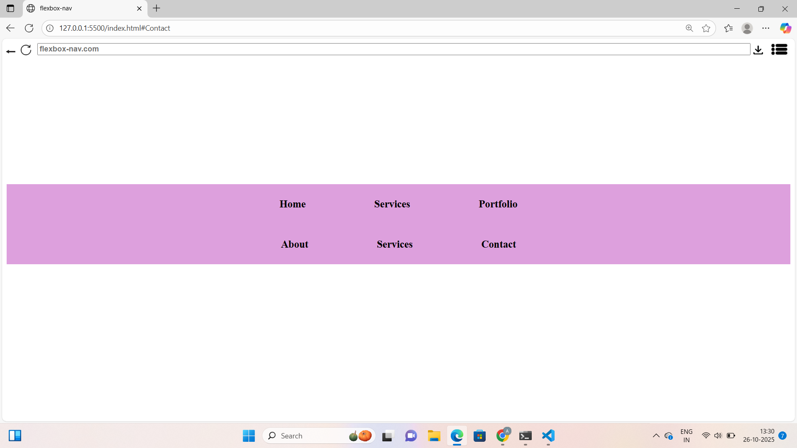

# 📰 Blog Post Layout – Modern & Responsive Web Design

A beautifully crafted **Blog Post Layout** showcasing clean UI, responsive design, and organized content presentation.  
Built with **HTML, CSS, and JavaScript**, this project demonstrates a strong understanding of frontend structure, layout design, and user experience — perfect for portfolio display or blog integration.

---

## ✨ Why This Project Stands Out

This project reflects my ability to:
- Design **responsive and accessible** layouts for multiple screen sizes  
- Implement **clean, semantic HTML** and maintainable **CSS architecture**  
- Blend **aesthetic design** with **functional usability**  
- Create an engaging reading experience for digital content  

💡 *It’s more than just a layout — it’s a demonstration of frontend craftsmanship.*

---

## 🔍 Key Highlights

- 🧩 **Reusable blog card design** with image, title, and metadata  
- 🖋️ **Typography-focused layout** for improved readability  
- 📱 **100% mobile responsive** using flexible grid and media queries  
- ⚡ Lightweight & fast-loading – no frameworks required  
- 🎨 Clean, minimal UI perfect for personal or professional blogging

---

## 🛠️ Tech Stack

| Technology | Purpose |
|-------------|----------|
| **HTML5** | Semantic structure |
| **CSS3** | Styling and responsiveness |
| **JavaScript (ES6)** | Minor interactivity |

---

## 🖼️ Screenshots

### Homepage  


### Blog Post Page  


> *Visuals matter — these screenshots represent the live design experience.*

---

## 🌐 Live Demo

🔗 **[View Live Project](http://127.0.0.1:5500/index.html)**  
*(Deployed using Netlify / GitHub Pages / Vercel)*

---

## ⚙️ How to Run Locally

```bash
# Clone the repository
git clone https://github.com/your-username/blog-post-layout.git

# Move into the project directory
cd blog-post-layout

# Open in browser
start index.html

🚀 Future Enhancements

💬 Add real-time comment system using Firebase

🧠 Integrate with a CMS (Contentful / Strapi)

🌙 Implement dark & light mode

🏷️ Add category filtering and tags

💬 Project Insight

“Started as a small layout experiment, ended up becoming one of my cleanest and most polished designs.”

Built with passion for frontend development — this project represents my eye for design, attention to detail, and code discipline.
It’s a glimpse of how I bring ideas to life on the web.

📬 Connect With Me

💻 GitHub: ankithakanneboina

🔗 LinkedIn: https://www.linkedin.com/in/ankitha-kanneboina-45a545324/

📧 Email: ankithakanneboina350@email.com
